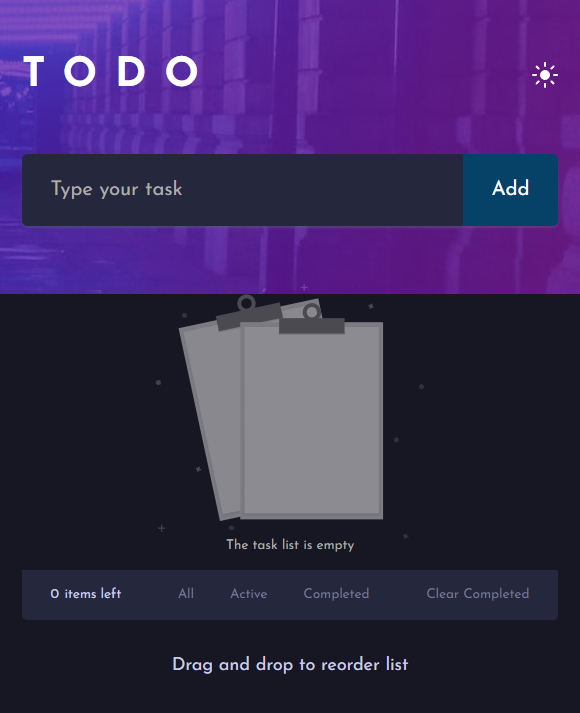

# 🌐 To-Do List Application

## 📝 Description

The To-Do List Application is a comprehensive web project developed using HTML5, CSS3, and JavaScript. This project aims to simplify daily task management with a modern user interface and a seamless user experience. The application includes multiple features such as adding, deleting, and organizing tasks, along with a responsive design that ensures optimal viewing on all devices.

### Screenshot



## ✨ Features

- **HTML5:** Structuring the website with advanced semantic elements.
- **CSS3:** Designing the site using Flexbox and Grid for complex, responsive layouts.
- **JavaScript (ES6+):** Adding interactivity and full control over tasks in an efficient manner.
- **Add New Tasks:** Input tasks and add them to the list with a simple interface.
- **Remove Tasks:** Delete tasks individually or clear all completed tasks with a confirmation prompt.
- **Task Status:** Mark tasks as completed and filter them based on their status.
- **Theme Toggle:** Switch between dark and light modes to enhance readability and comfort.
- **Reordering:** Rearrange tasks using drag-and-drop functionality for better organization.
- **Responsive Layout:** Adapts to different screen sizes for a seamless user experience across devices.
- **CSS Animations:** Adding enhanced visual effects to improve the user experience.
- **Drag and Drop:** Easily reorder tasks through a drag-and-drop interface.

## 🚀 Challenges and Solutions

Throughout the development of the To-Do List Application, I encountered and successfully overcame various challenges:
- **🌐 Cross-browser Compatibility:** Ensuring consistent appearance and functionality across different browsers.
- **📱 Responsive Design:** Making sure the site adapts seamlessly to different screen sizes and resolutions.
- **⚡ Performance Optimization:** Creating smooth and efficient animations that enhance user interaction without compromising performance.

## 🛠️ Installation

To run the project locally, follow these steps:
1. Clone the repository:
    ```bash
    git clone https://github.com/MohamedRafatabotaleb/Todo.git
    ```
2. Navigate to the project directory:
    ```bash
    cd todo-list
    ```
3. Open `index.html` in your preferred web browser.

## 🌍 Live Demo

You can view the live version of the project [here](https://todo-list-almdrasa.netlify.app/).

## 💡 Usage

Explore the features and test the responsiveness of the website by resizing your browser window and interacting with the animated elements. The project demonstrates a modern approach to web design and development, suitable for various devices and screen sizes.

## 🤝 Contributing

Contributions are welcome and appreciated. To contribute:
1. Fork the repository.
2. Create a new feature branch:
    ```bash
    git checkout -b feature-branch
    ```
3. Make your changes and commit them:
    ```bash
    git commit -m 'Add new feature'
    ```
4. Push to the branch:
    ```bash
    git push origin feature-branch
    ```
5. Open a pull request.

## 📬 Contact

For any inquiries, feedback, or suggestions, please feel free to contact me at mohamedrafat.abotaleb@gmail.com.

---

Developed by [Mohamed Rafat Mohamed](https://github.com/MohamedRafatabotaleb)
